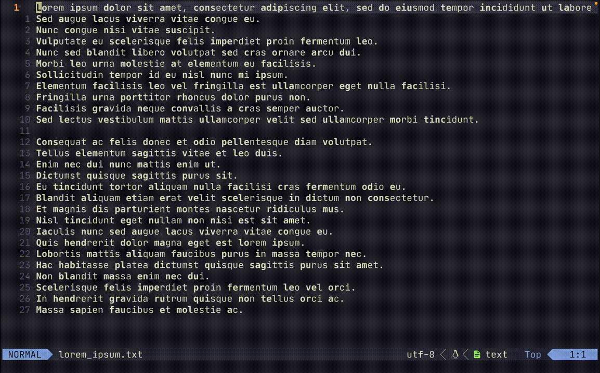

# easyread.nvim

bionic-like reading in Neovim.



Get through that pesky wall of text a little easier!

## Features

- Custom highlighting amounts and style
- Saccade interval and line reset
- Update during insert mode
- Default file types

## Installation

Install using your preferred package manager.

Example with [packer.nvim](https://github.com/wbthomason/packer.nvim)

```lua
use {
    'JellyApple102/easyread.nvim'
}
```

## Configuration

If you are okay with the defaults, just calling `setup` is enough.
```lua
-- Default configuration
require('easyread').setup{
    hlValues = {
        ['1'] = 1,
        ['2'] = 1,
        ['3'] = 2,
        ['4'] = 2,
        ['fallback'] = 0.4
    },
    hlgroupOptions = { link = 'Bold' },
    fileTypes = { 'text' },
    saccadeInterval = 0,
    saccadeReset = false,
    updateWhileInsert = true
}
```
## Options

- `hlValues`

This table determines how many characters of a word to highlight based on word length.
Lengths represented by string indexes are explicitly defined.

Any other word lengths use the `fallback` value, between 0 and 1, representing how much of a word to highlight.
0.3 highlights 30% of the word, 0.4 highlights 40%, etc.

- `hlgroupOptions`

This table is passed to `nvim_set_hl()` as the `{val}` parameter.
See `:h nvim_set_hl()` for more information.

- `fileTypes`

Table of file types to have easyread automatically highlight.
Can be set to none with:
```lua
require('easyread').setup{
    fileTypes = {}
}
```

- `saccadeInterval`

How many words go unhighlighted between highlighted words.

- `saccadeReset`

Whether to reset the saccadeInterval on each line.

- `updateWhileInsert`

Whether to update highlighting while in insert mode.

## Commands

easyread provides several user commands:

- `:EasyreadToggle` switches the current buffer between highlighted and not.
- `:EasyreadSaccadeInterval {num}` sets the saccade interval to the given number.
- `:EasyreadSaccadeReset` toggles the saccade line reset behaiour.
- `:EasyreadUpdateWhileInsert` toggles updating highlights during insert mode.

## Notes

Theme used in demo gif is [kanagawa](https://github.com/rebelot/kanagawa.nvim).
